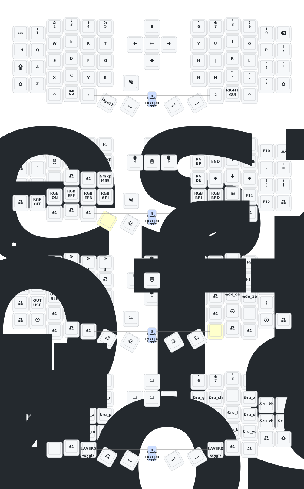

 

Flashing the Firmware:

1. Download the latest firmware from the [builds page](https://github.com/gerzen/zmk-sofle/actions?page=1

2. Extract the downloaded file to a folder on your computer. There will be 3 files: eyelash_sofle.uf2, eyelash_sofle_left.uf2, and eyelash_sofle_studio_left.uf2, nice_view_custom-eyelash_sofle_right-zmk.uf2, and settings_reset-eyelash_sofle_left-zmk.uf2

3. Connect the left keyboard part to your computer.

4. Put the  keyboard part into bootloader mode by double pressing the button on the bottom side of the board.

5. The board will be detected as NICENANO drive.

6. Copy the settings_reset-eyelash_sofle_left-zmk.uf2 file to the drive. It will reset the settings of the left part of the keyboard and disconnect the drive. Double press the button again to put the board into bootloader mode.
7. Copy the eyelash_sofle_studio_left.uf2 file to the drive. It will flash the firmware to the left part of the keyboard and disconnect the drive. 
8. Unplug the left part of the keyboard from your computer.
9. Plug the right part of the keyboard to your computer.
10. Repeat steps 4-8, but this time use the nice_view_custom-eyelash_sofle_right-zmk.uf2 file.